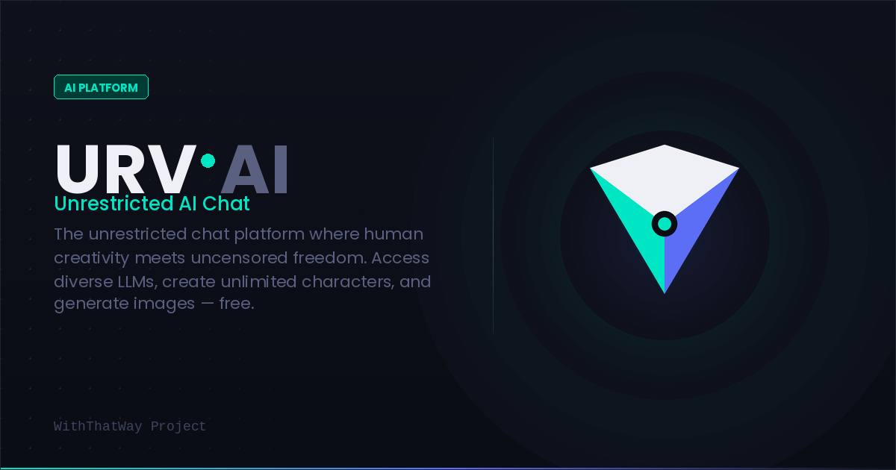

# URV AI

**Understanding · Reasoning · Value**

A free, unrestricted roleplay AI chat — no account, no paywall, no filters.

 

---

## What is URV AI?

URV AI is a free roleplay chat platform powered by AI. You can create your own characters, build rich story worlds, and have uncensored conversations — all from your browser. No sign-up required.

Whether you're into casual chat, deep worldbuilding, or creative writing, URV AI gives you the freedom to explore without limits.

---

## What can you do?

### 🎭 Roleplay & Characters
- Chat with AI characters in any scenario you can imagine
- Create your own characters with custom names, personalities, and backstories
- Interact with multiple characters in the same conversation
- Import characters from **SillyTavern V2 format** (`.json`)
- Switch characters mid-session without losing context

### 📖 Worldbuilding & Lore
- Build your own lore with a built-in **Lorebook** — define places, factions, relationships, and events that the AI always remembers
- Set a custom scenario or world description for each chat
- Keep your story consistent across long sessions with memory anchoring

### 🤖 AI Models
- Access a variety of AI models and switch between them freely
- No single model lock-in — pick what works best for your story

### 🖼️ Image Generation
- Generate images directly inside the chat to bring your characters and scenes to life

### ✨ Quality of Life
- Dark and light theme
- Custom chat wallpapers
- Full chat history with branching — go back to any point and take the story in a new direction
- Mobile friendly

---

## How to get started

1. Go to **[urv-ai.vercel.app](https://urv-ai.vercel.app)** or open the app directly at **[perchance.org/urv-ai-chat](https://perchance.org/urv-ai-chat)**
2. Pick a model
3. Create a character or start chatting right away — no account needed

---

## Importing characters

URV AI supports the **SillyTavern V2 character card format**. If you have existing character `.json` files from SillyTavern or compatible apps, you can import them directly into URV AI without any changes.

---

## Free. Always.

URV AI is and will remain free to use. No premium tiers, no message limits, no hidden paywalls.

---

## Credits

Built and maintained by **[WithThatWay](https://perchance.org/withthatway)**

---

  URV AI · V2 · Understanding · Reasoning · Value

